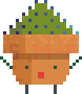
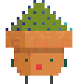
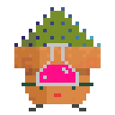
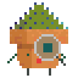
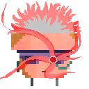

<h1 align="center">  Hi there! </h1>

-  My name is <strong>Shanny</strong>.

-  I am currently working in healthcare as a Respiratory Scientist and Sleep Technician, with some background in Cardiac.

-  I aspire to transition into a Full-stack Web Developer and Software Engineer!

-  I am actively exploring diverse domains within Computer Science and Web Development, including Cybersecurity, Game Design and Development, alongside a strong interest in UX/UI Design.

  - Technologies I use and have dived into, seeking continuous development in:

    <!--  -->

    
    
    
    
    
    
    
    
    
    
    

  - In the pipeline:

    
    
    
    
    
    

    <!--  -->

-  I’m currently focusing on web development. <!-- [creative coding](https://github.com/ShannyxMP/Creative-Coding-Projects.git) using JavaScript. -->

<!--
- 👯 I’m looking to collaborate on ...
- 🤔 I’m looking for help with ...
- 💬 Ask me about ...
- 📫 How to reach me: ... !!!
- 😄 Pronouns: ...
-->

-  Fun fact: I am learning Japanese, and enjoy gouache and digital painting.
