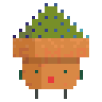

<h1 style="text-align:center">  Hi there! </h1>

-  My name is <strong>Shanny</strong>.

-  I am currently working in healthcare as a Respiratory Scientist and Sleep Technician, with some background in Cardiac.

-  I aspire to transition into a Full-stack Web Developer and Software Engineer!

-  I am interested in learning Computer Science and Web Development.

  - Technologies I use and have dived into, seeking continuous development in:

    <!--  -->

    
    
    
    
    
    
    
    
    
    

  - In the pipeline:

    
    
    

-  I’m currently focusing on [creative coding](https://github.com/ShannyxMP/Creative-Coding-Projects.git) using Javascript.

<!--
- 👯 I’m looking to collaborate on ...
- 🤔 I’m looking for help with ...
- 💬 Ask me about ...
- 📫 How to reach me: ... !!!
- 😄 Pronouns: ...
-->

-  Fun fact: I am learning Japanese.
    

